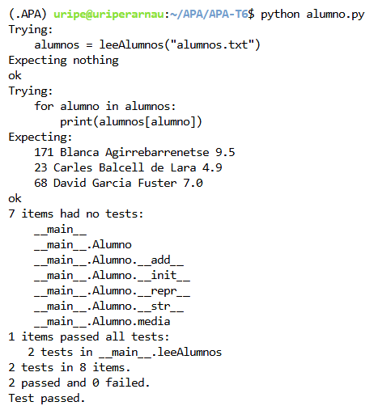

# Expresiones Regulares

## Nom i cognoms

ORIOL PERARNAU MONFORT

---

# Tratamiento de ficheros de notas y normalización de expresiones horarias

Esta práctica implementa dos tareas mediante el uso de expresiones regulares en Python:

1. **Tratamiento de ficheros de notas**
   - Lectura de un fichero de alumnos.
   - Creación automática de objetos `Alumno`.
   - Almacenamiento de los alumnos en un diccionario cuya clave es el nombre completo.

2. **Normalización de expresiones horarias**
   - Detección de distintas formas de expresar horas en castellano.
   - Conversión automática al formato estándar `HH:MM`.
   - Conservación de expresiones incorrectas sin modificar.

---

# Ejecución de los tests unitarios

A continuación se muestra la ejecución de los tests unitarios de `alumno.py` utilizando la opción verbosa de `doctest`.



La ejecución se ha realizado mediante:

```bash
python alumno.py
```

o bien

```bash
python -m doctest -v alumno.py
```

---

# Código desarrollado

## alumno.py

```python
import re


class Alumno:
    """
    Clase usada para el tratamiento de las notas de los alumnos. Cada uno
    incluye los atributos siguientes:

    numIden:   Número de identificación.
    nombre:    Nombre completo del alumno.
    notas:     Lista de números reales con las distintas notas.
    """

    def __init__(self, nombre, numIden=-1, notas=[]):
        self.numIden = numIden
        self.nombre = nombre
        self.notas = [nota for nota in notas]

    def __add__(self, other):
        return Alumno(self.nombre, self.numIden, self.notas + [other])

    def media(self):
        return sum(self.notas) / len(self.notas) if self.notas else 0

    def __repr__(self):
        return f'Alumno("{self.nombre}", {self.numIden!r}, {self.notas!r})'

    def __str__(self):
        return f'{self.numIden}\t{self.nombre}\t{self.media():.1f}'


def leeAlumnos(ficAlum):
    """
    Lee un fichero de alumnos y devuelve un diccionario cuya clave es
    el nombre completo del alumno.

    >>> alumnos = leeAlumnos("alumnos.txt")
    >>> for alumno in alumnos:
    ...     print(alumnos[alumno])
    ...
    171 Blanca Agirrebarrenetse 9.5
    23 Carles Balcell de Lara 4.9
    68 David Garcia Fuster 7.0
    """

    alumnos = {}

    patron = re.compile(
        r'^\\s*(\\d+)\\s+([A-Za-zÁÉÍÓÚÜÑáéíóúüñ ]+?)\\s+((?:\\d+(?:\\.\\d+)?\\s*)+)$'
    )

    with open(ficAlum, encoding="utf-8") as f:
        for linea in f:
            linea = linea.strip()

            m = patron.match(linea)

            if not m:
                continue

            num = int(m.group(1))
            nombre = m.group(2).strip()

            notas = [
                float(n)
                for n in re.findall(r'\\d+(?:\\.\\d+)?', m.group(3))
            ]

            alumnos[nombre] = Alumno(nombre, num, notas)

    return alumnos
```

---

## horas.py

```python
import re


def normalizaHoras(ficText, ficNorm):

    def hhmm(h, m):
        return f"{h:02d}:{m:02d}"

    def reemplazar_horas(linea):

        def h_m(match):
            h = int(match.group(1))
            m = match.group(2)

            if h > 23:
                return match.group(0)

            if m is None:
                return hhmm(h, 0)

            m = int(m)

            if m > 59:
                return match.group(0)

            return hhmm(h, m)

        linea = re.sub(
            r'\\b([01]?\\d|2[0-3])h(?:([0-5]?\\d)m)?\\b',
            h_m,
            linea
        )

        linea = re.sub(
            r'\\b([01]?\\d|2[0-3]):([0-5]\\d)\\b',
            lambda m: hhmm(int(m.group(1)), int(m.group(2))),
            linea
        )

        linea = re.sub(
            r'\\b([1-9]|1[0-2])\\s+en\\s+punto\\b',
            lambda m: hhmm(int(m.group(1)) % 12, 0),
            linea
        )

        linea = re.sub(
            r'\\b([1-9]|1[0-2])\\s+y\\s+cuarto\\b',
            lambda m: hhmm(int(m.group(1)) % 12, 15),
            linea
        )

        linea = re.sub(
            r'\\b([1-9]|1[0-2])\\s+y\\s+media\\b',
            lambda m: hhmm(int(m.group(1)) % 12, 30),
            linea
        )

        def menos_cuarto(match):
            h = int(match.group(1))
            h = 12 if h == 1 else h - 1
            return hhmm(h % 12, 45)

        linea = re.sub(
            r'\\b([1-9]|1[0-2])\\s+menos\\s+cuarto\\b',
            menos_cuarto,
            linea
        )

        def manana(match):
            h = int(match.group(1))
            if 4 <= h <= 12:
                return hhmm(0 if h == 12 else h, 0)
            return match.group(0)

        linea = re.sub(
            r'\\b([1-9]|1[0-2])(?:h)?\\s+de\\s+la\\s+mañana\\b',
            manana,
            linea
        )

        def mediodia(match):
            h = int(match.group(1))
            if h in (12, 1, 2, 3):
                return hhmm(12 if h == 12 else h + 12, 0)
            return match.group(0)

        linea = re.sub(
            r'\\b([1-9]|1[0-2])\\s+del\\s+mediod[ií]a\\b',
            mediodia,
            linea
        )

        def tarde(match):
            h = int(match.group(1))
            if 3 <= h <= 8:
                return hhmm(h + 12, 0)
            return match.group(0)

        linea = re.sub(
            r'\\b([1-9]|1[0-2])\\s+de\\s+la\\s+tarde\\b',
            tarde,
            linea
        )

        def noche(match):
            h = int(match.group(1))

            if h == 12:
                return "00:00"

            if 8 <= h <= 11:
                return hhmm(h + 12, 0)

            if 1 <= h <= 4:
                return hhmm(h, 0)

            return match.group(0)

        linea = re.sub(
            r'\\b([1-9]|1[0-2])\\s+de\\s+la\\s+noche\\b',
            noche,
            linea
        )

        def madrugada(match):
            h = int(match.group(1))
            if 1 <= h <= 6:
                return hhmm(h, 0)
            return match.group(0)

        linea = re.sub(
            r'\\b([1-9]|1[0-2])\\s+de\\s+la\\s+madrugada\\b',
            madrugada,
            linea
        )

        return linea

    with open(ficText, encoding="utf-8") as entrada, \
         open(ficNorm, "w", encoding="utf-8") as salida:

        for linea in entrada:
            salida.write(reemplazar_horas(linea))
```

---

# Repositorio GitHub

La práctica se ha subido al repositorio GitHub indicado en el enunciado y se ha realizado la correspondiente Pull Request para su evaluación.